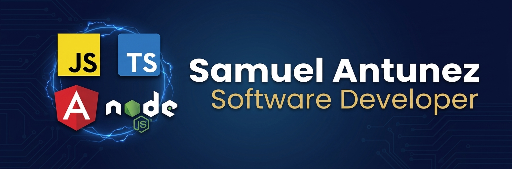

  

# ¡Hola! Soy Samuel Antunez 👋

**Ingeniero de Sistemas** y **Desarrollador Full Stack Junior**, especializado en el ecosistema JavaScript/TypeScript. Construyo apps web escalables con **Angular** y **Node.js** aplicando Clean Code y Clean Architecture.

### 🚀 Proyectos Destacados

#### 💼 Sistema Integral de Nómina (SIN) — UNEFA (Pasantías, privado)
Sistema web full-stack para automatizar el cálculo de nómina (antes en Excel) de forma auditable.
* **Tech Stack:** Angular, Signals, Node.js, Express.js, PostgreSQL, Prisma ORM, JWT, Docker, Clean Architecture.
* **Destacado:** motor de nómina configurable con fórmulas dinámicas (mathjs), auditoría completa por operación (usuario/IP/timestamp), Clean Architecture en 4 capas.

#### 🕹️ [Arcade Vault](https://github.com/SamuelAntunez/Arcade-Vault-SDD-Claude)
Plataforma arcade retro-neón desarrollada 100% con Spec-Driven Design usando Claude Code.
* **Tech Stack:** Next.js, React, TypeScript, Tailwind CSS, App Router.
* **Demo:** [arcade-vault-sdd-claude.vercel.app](https://arcade-vault-sdd-claude.vercel.app)

#### 🛒 Artemas Shop — [API (NestJS)](https://github.com/SamuelAntunez/nest-artemas-shop) + [Frontend (Angular)](https://github.com/SamuelAntunez/Artemas-shop)
Tienda full-stack: API modular NestJS + frontend Angular con Signals consumiéndola.
* **Tech Stack:** NestJS, TypeORM, PostgreSQL, JWT, Swagger, Docker / Angular, Signals, Tailwind CSS.
* **Demo:** [artemas-shop.vercel.app](https://artemas-shop.vercel.app)

#### 🗺️ [Mapas Interactivos (MapLibre GL)](https://github.com/SamuelAntunez/Mapa-ng-maplibre-gl)
Visualización geoespacial con Angular y MapLibre GL JS.
* **Demo:** [samuel-map-app.netlify.app](https://samuel-map-app.net

#### 🖥️ [Monitoreo NOC](https://github.com/SamuelAntunez/Aplicacion-de-Monitoreo-NOC)
Monitoreo de servicios con alertas por correo, soporte multi-DB (Poite).

#### 🌍 [Country SPA](https://github.com/SamuelAntunez/Country-SPA) · 🔍 [Gifs App](https://github.com/SamuelAntunez/Gifs-App) · 📡 [Node REST Server](https://github.com/SamuelAntunez/Node-Web-RestServer-PGSQL)
Proyectos de práctica: consumo de APIs públicas, Signals, scroll infinito, REST desde cero.

### 🛠️ Tecnologías

**Frontend:**   

**Backend:**  

**Bases de Datos:**    Prisma · TypeORM

**Herramientas:** 

**Aprendiendo:** C# / .NET

### 📫 Conectemos

**samueljoseantunez@gmail.com**

### 📊 Estadísticas

